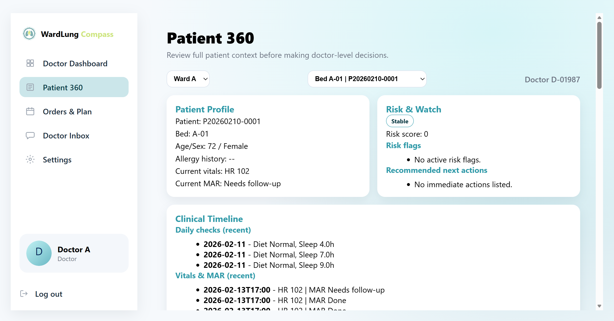
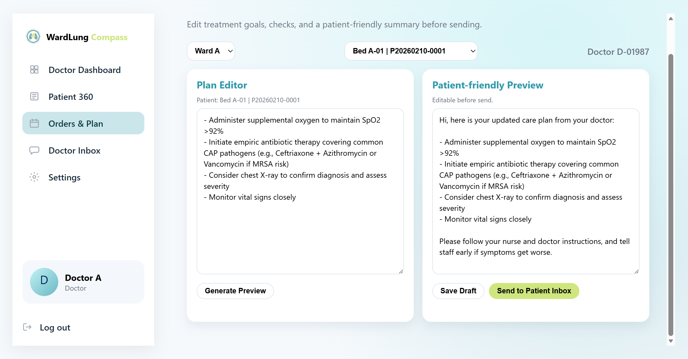
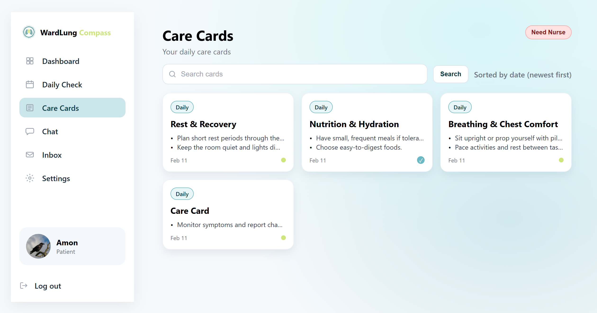
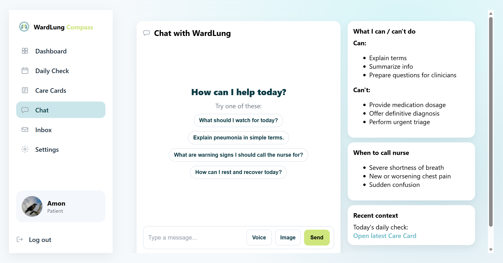
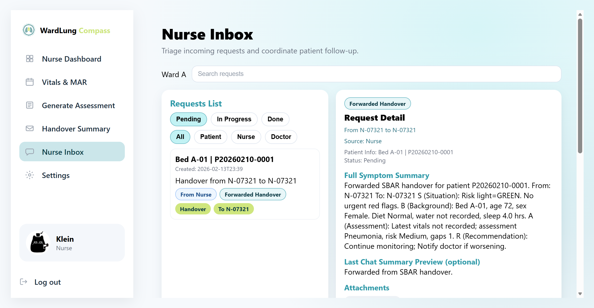
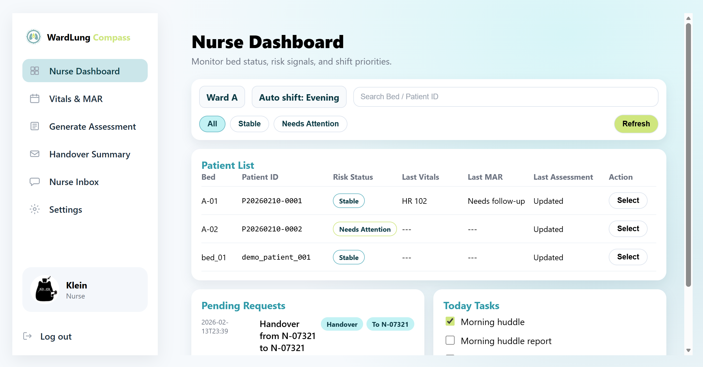
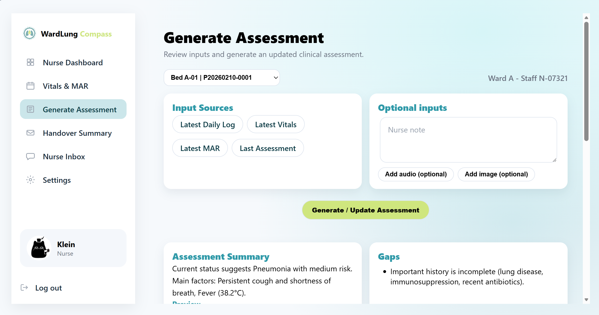
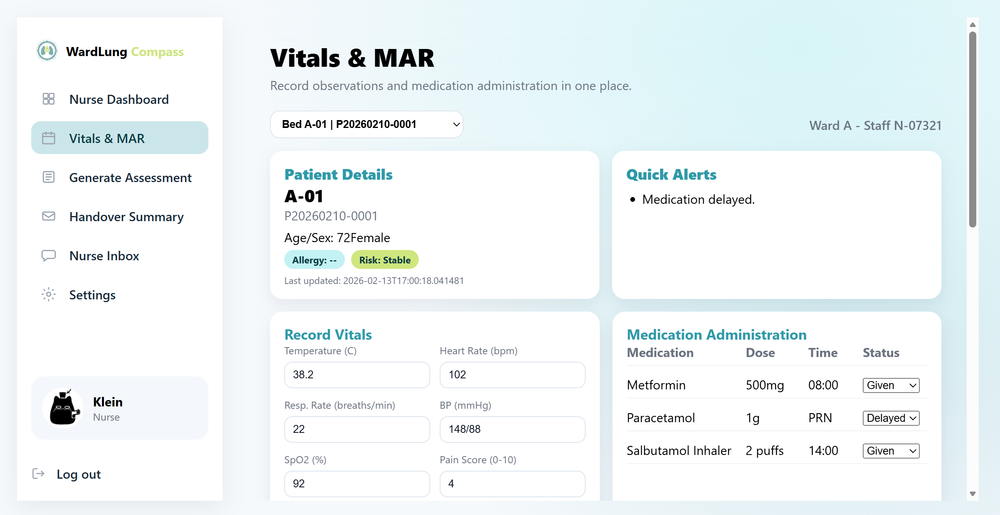

# WardLung Compass (MedGemma Impact Challenge)

> 🏥 Ward workflow • 🤖 Multimodal AI • 📚 RAG

WardLung Compass is a ward-focused multi-role clinical collaboration prototype.
It links patient self-reporting, nurse workflows, and doctor decision workflows in one closed loop, with multimodal AI support (text, voice, image, and RAG).

This repository currently focuses on a pneumonia ward workflow.

## 🎬 Demo (YouTube)

[](https://youtu.be/sfT0goJFcDs)

## 🖼️ Figures

Real page screenshots:

<table>
  <tr>
    <td></td>
    <td></td>
  </tr>
  <tr>
    <td></td>
    <td></td>
  </tr>
  <tr>
    <td></td>
    <td></td>
  </tr>
  <tr>
    <td></td>
    <td></td>
  </tr>
</table>

## 🎯 1. What This Project Solves

1. Patient side: unstructured symptom expression, weak recall of clinical instructions, and difficulty tracking daily status.
2. Nurse side: triage, vitals/MAR recording, assessment generation, handover, and upward forwarding in one interface.
3. Doctor side: quick 360 patient review (risk trends, evidence, gaps) and delivery of patient-readable plans.

## 🧰 2. Tech Stack

- Backend: Python, FastAPI, Uvicorn, SQLite
- AI models:
  - LLM: `google/medgemma-1.5-4b-it`
  - Vision: `google/medsiglip-448`
  - ASR: `google/medasr`
  - RAG: LlamaIndex + HuggingFace Embedding + FAISS
- Frontend: server-rendered HTML + vanilla JS (actions via `wlApi`)

## 🏗️ 3. System Architecture

Core modules:

- `app.py`: app entrypoint, login/session, action routing, upload APIs, page shell.
- `src/ui/patient_app.py`: patient-side state and actions.
- `src/ui/nurse_app.py`: nurse-side and doctor-side state and actions.
- `src/ui/patient_pages.py`, `src/ui/staff_pages.py`: page rendering.
- `src/agents/orchestrator.py`: multimodal assessment chain (ASR, vision, RAG, diagnosis/audit/reverse differential).
- `src/agents/ward_agent.py`: high-level ward workflow entry.
- `src/tools/rag_engine.py`: indexing and retrieval.
- `src/store/sqlite_store.py`, `src/store/schemas.py`: data persistence.

Main request flow (simplified):

1. User logs in.
2. Frontend submits `action + payload` to `/api/action`.
3. Backend dispatches by role (`patient`, `nurse`, `doctor`).
4. Business logic updates state/database and calls model tools when needed.
5. Backend returns refreshed HTML fragment.

## 👥 4. Three-Side Capabilities

### 👤 4.1 Patient App

Pages: `Dashboard`, `Daily Check`, `Care Cards`, `Chat`, `Inbox`, `Settings`

Core capabilities:

1. Daily check-in and draft saving.
2. Log submission and care card generation trigger.
3. Multimodal chat (text/voice/image).
4. One-click nurse call (with optional voice/image attachments).
5. Inbox acknowledgment and reply.
6. Preference and password settings.

### 🧑‍⚕️ 4.2 Nurse Station

Pages: `Ward Dashboard`, `Vitals & MAR`, `Generate Assessment`, `Handover Summary`, `Nurse Inbox`, `Settings`

Core capabilities:

1. Ward triage and task overview.
2. Vitals and MAR input with risk snapshot refresh.
3. Assessment generation based on patient context and attachments.
4. SBAR handover summary generation/forwarding.
5. Inbox request handling and upward forwarding.

### 🩺 4.3 Doctor Console

Pages: `Doctor Dashboard`, `Patient 360`, `Orders & Plan`, `Doctor Inbox`, `Settings`

Core capabilities:

1. Request overview by risk/source.
2. Patient 360 with assessments, evidence, and tool traces.
3. Orders/plan editing, patient-friendly preview, and send.
4. Inbox request handling and response.
5. Patient/nurse account management in settings.

## 🔐 5. Login and Accounts

- Password credentials are stored in `account_credentials` (hashed).
- Login endpoint: `/api/login`.
- Current version adds self-registration from login page via `Create account`, with role selection (`Patient`, `Nurse`, `Doctor`).
- Demo accounts can be initialized via `src/store/seed_demo.py`.

Current seeded accounts:

- Seeded patients:
  - `demo_patient_001` (ward: `ward_a`, bed: `bed_01`)
  - `P20260210-0001` (ward: `ward_a`, bed: `A-01`)
  - `P20260210-0002` (ward: `ward_a`, bed: `A-02`)
  - `P20260210-0003` (ward: `ward_b`, bed: `B-03`)
  - `P20260210-0004` (ward: `ward_b`, bed: `B-04`)
- Seeded staff accounts:
  - `N-07321` (role: `nurse`, ward: `ward_a`)
  - `N-05288` (role: `nurse`, ward: `ward_b`)
  - `D-01987` (role: `doctor`, ward: `ward_a`)
  - `D-04512` (role: `doctor`, ward: `ward_b`)

Default password fallback variable:

- `DEMO_DEFAULT_PASSWORD` (default: `Demo@123`)
- All seeded accounts currently use: `Demo@123`
- Users can also self-register from the login page via `Create account`

## 🔌 6. Core APIs

- `GET /`
- `POST /api/register`
- `POST /api/login`
- `POST /api/logout`
- `POST /api/action`
- `GET /api/chat_poll`
- `POST /api/chat_image`
- `POST /api/chat_voice`
- `POST /api/request_nurse_image`
- `POST /api/request_nurse_audio`
- `POST /api/assessment_image`
- `POST /api/assessment_audio`
- `POST /api/handover_forward_image`
- `POST /api/handover_forward_audio`

## 🗂️ 7. Directory Structure

```text
.
├─ app.py
├─ requirements.txt
├─ src
│  ├─ agents
│  ├─ auth
│  ├─ store
│  ├─ tools
│  ├─ ui
│  └─ utils
├─ figures
├─ data
└─ models
```

## 🚀 8. Quick Start

### 📦 8.1 Install dependencies

```powershell
pip install -r requirements.txt
```

System dependency:

- `ffmpeg` (required by `pydub`)

### 🔑 8.2 Hugging Face Access (Gated Models)

This project downloads Hugging Face models over HTTPS via `transformers`/`huggingface_hub` (not SSH).

If you see 401/403 when downloading `google/medgemma-1.5-4b-it`, `google/medsiglip-448`, or `google/medasr`, you likely need gated access:

1. Log in on Hugging Face and open each model repo page.
2. Complete the required action (e.g., "Agree and access", "Request access", or accept terms). Some models require approval.
3. Create a Hugging Face Access Token (read scope is typically enough) and expose it to the app:

```powershell
# Current terminal only
$env:HF_TOKEN="hf_xxx"

# Or (fallback env var name also supported by this repo)
$env:HUGGINGFACE_HUB_TOKEN="hf_xxx"
```

Persistent (Windows):

```powershell
setx HF_TOKEN "hf_xxx"
```

### ▶️ 8.3 Run

Make sure `HF_TOKEN` (or `HUGGINGFACE_HUB_TOKEN`) is set before the first run if you need gated model access.

```powershell
python app.py
```

Default URL: `http://localhost:8000/`

## ⚙️ 9. Common Environment Variables

Runtime/network:

- `HOST` (default `0.0.0.0`)
- `PORT` (default `8000`)
- `ENABLE_PUBLIC_TUNNEL`
- `PUBLIC_TUNNEL_PROVIDER` (`auto|cloudflared|ngrok`)
- `PUBLIC_TUNNEL_TIMEOUT_SEC`
- `NGROK_AUTHTOKEN`

Model behavior:

- `FORCE_CUDA`
- `MED_ASR_DEVICE` (`cpu|cuda|auto`)
- `MEDSIGLIP_DEVICE` (`cpu|cuda|auto`)
- `MED_ASR_USE_FP16`
- `MEDGEMMA_MAX_NEW_TOKENS`
- `MEDGEMMA_RETRY_MAX_NEW_TOKENS`
- `MEDGEMMA_MAX_INPUT_TOKENS`
- `RAG_EVIDENCE_TOTAL_CHARS`
- `HANDOVER_USE_LLM`
- `DOCTOR_PLAN_PREVIEW_USE_LLM`

Auth:

- `DEMO_DEFAULT_PASSWORD`
- `HF_TOKEN` (or `HUGGINGFACE_HUB_TOKEN`) for gated Hugging Face model downloads
